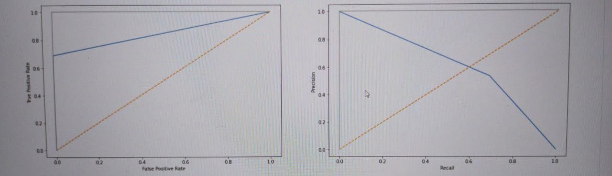
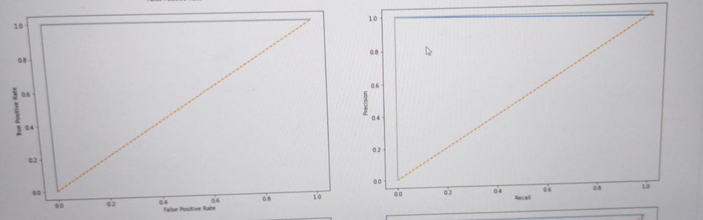
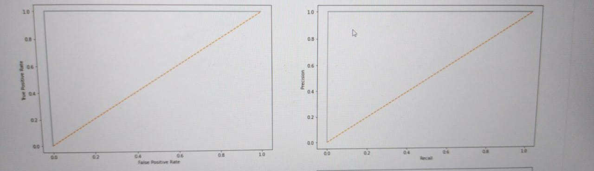
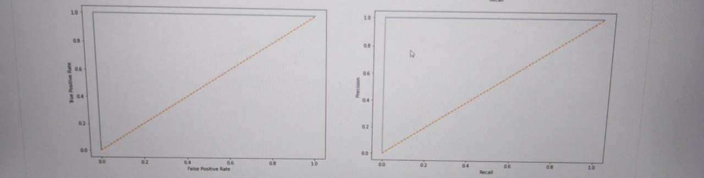
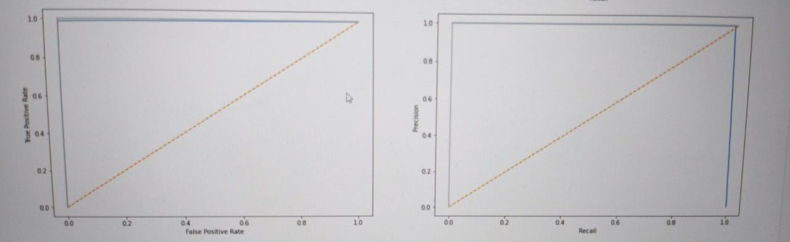
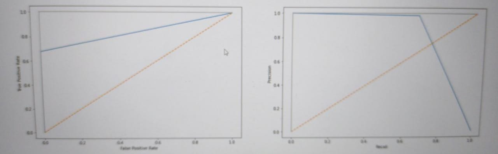
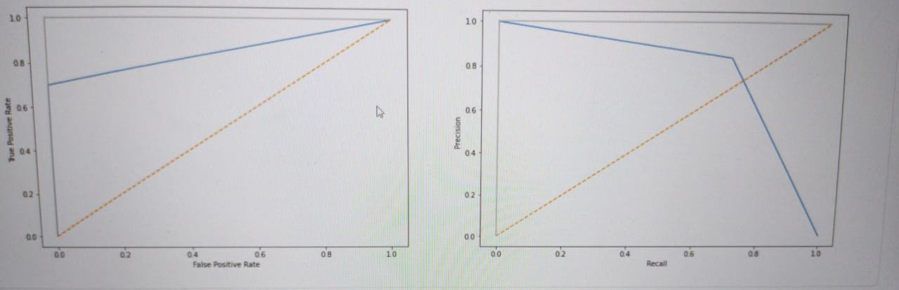

# Loan-defaulters-prediction

## Language
Python

## Objective
* Financial giants that provide loans to individuals on a daily basis, it’s very crucial to deal with people defaulting on the payment. This is why Banks would give loans to only those customers that are eligible so that they can be assured of getting the money back.
* These financial giants have presence across all urban, semi urban and rural areas. Customer first apply for home loan after that company validates the customer eligibility for loan.
* Doing this manually takes a lot of time. Hence automating the loan eligibility process (real time) based on customer information will help save a lot of manual effort and can be done very fast that helps provide loan quickly too.

## Data Description
https://www.kaggle.com/sonujha090/xyzcorp-lendingdata
* Loan data from the past few years(2007-2015) has been provided to use and create a model that will help the firm is predicting the defaulters for the loan provided.
* It consists into approximately 8,50,000 data samples of loans granted by a financial giant, with the full set of informations about the borrower,the history of payments and the outcome of the loan.
* Data is Unbalanced with only 5% of the total population defaulting the loan.

## Approach:
* EDA
* Statistical Analysis
* Feature Engineering was done to extract the important features that was used for modelling.
* Accuracy of each algorithm was compared and the best model was selected.

## Algorithm and Performance:
### 1. Logistic Regression
* F1 score of Logistic Regression is 0.602.
* Precision of the model is 0.534.
* Recall of the model is 0.689.
* Accuracy of Model is 0.999.
* ROC_AUC CURVE AND PRECISION-RECALL CURVE

### 2. Decision tree
* F1 score of DecisionTree Classifier is 0.989.
* Precision of the model is 0.978.
* Recall of the model is 1.0.
* Accuracy of Model is 0.999.
* ROC_AUC CURVE AND PRECISION-RECALL CURVE

### 3. ExtraTree
* F1 score of ExtraTree Classifier is 1.0.
* Precision of the model is 1.0.
* Recall of the model is 1.0.
* Accuracy of Model is 1.0.
* ROC_AUC CURVE AND PRECISION-RECALL CURVE

### 4. Random Forest
* F1 score of RandomForest Classifier is 1.0.
* Precision of the model is 1.0.
* Recall of the model is 1.0.
* Accuracy of Model is 1.0.
* ROC_AUC CURVE AND PRECISION-RECALL CURVE

### 5. Xgboost
* F1 score of XGBoost is 0.994.
* Precision of the model is 1.0.
* Recall of the model is 0.989.
* Accuracy of Model is 0.999. 
* ROC_AUC CURVE AND PRECISION-RECALL CURVE

### 6. KNN
* F1 score of KNN is 0.803.
* Precision of the model is 0.984.
* Recall of the model is 0.678.
* Accuracy of Model is 0.999.
* ROC_AUC CURVE AND PRECISION-RECALL CURVE

### 7. SVM.
* F1 score of SVM is 0.764.
* Precision of the model is 0.84.
* Recall of the model is 0.7.
* Accuracy of Model is 0.999.
* ROC_AUC CURVE AND PRECISION-RECALL CURVE

## Encoding Techniques:
Label encoding.

### FOR COMPLETE DATA ANALYSIS PLEASE REFER MY .ipynb FILE.
